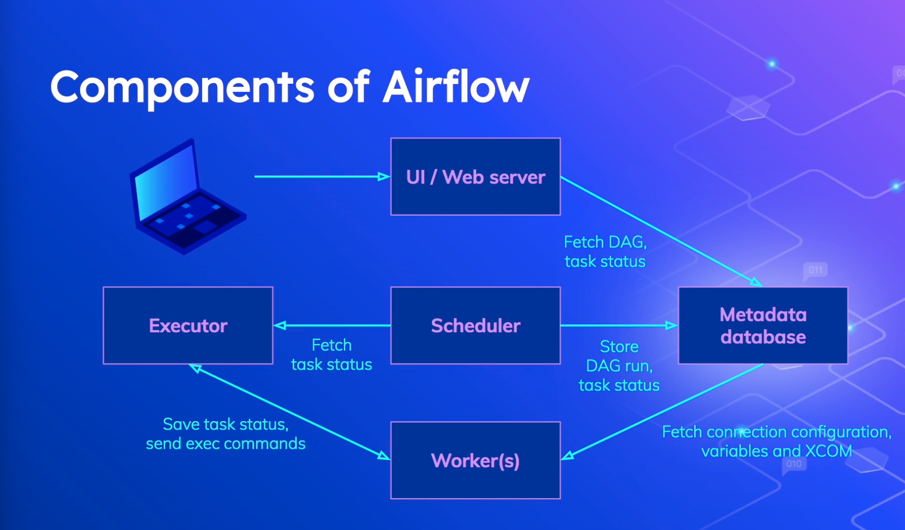

## What is Apache Airflow?

- Workflow management platform
- Directed Acyclic Graphs(DAGs)
- Configuration as code in Python
- Schedules and executes tasks
- Highly scalable

Mostly used by data sector for ETL processing and ML pipelines.




## Google Cloud CLI
Its neccessary to operate with GCP Services like Storage Buckets and BigQuery operators.
```shell
gcloud config list
gcloud auth login # Authenticate through browser
gcloud config set project PROJECT_ID
# To change the default region:
gcloud config set compute/region your-new-region
# To change the default zone:
gcloud config set compute/zone your-new-zone
# Verify the changes
gcloud confit list
# Setting application default project
gcloud auth application-default set-quota-project
gcloud projects list
```

### Airflow CLI
Triggering DAGS and managing workflow is done through CLI or WebSever Interace.
```shell
airflow dags unpause example_bash_operator
# Dag: example_bash_operator, paused: False

airflow dags trigger core_concepts
# Created <DagRun core_concepts @ 2023-10-14T08:49:35+00:00: manual__2023-10-14T08:49:35+00:00, state:queued, queued_at: 2023-10-14 08:49:35.682724+00:00. externally triggered: True>

airflow dags list
#dag_id              | filepath              | owner   | paused
#====================+=======================+=========+=======
#bigquery_data_load  | bigquery_data_load.py | Niko    | True  
#core_concepts       | core_concepts.py      | Niko    | True  
#create_simple_table | create_bq_table.py    | Airflow | True  

# To create a db user if it's not handled inside a containers configurations
airflow users create -r Admin -u admin -e admin@admin.com -f Admin -l Admin -p admin

airflow dags show core_concepts
# digraph core_concepts {
#        graph [label=core_concepts labelloc=t rankdir=LR]
#        bash_command [color="#000000" fillcolor="#f0ede4" label=bash_command shape=rectangle style="filled,rounded"]
#        python_function [color="#000000" fillcolor="#ffefeb" label=python_function shape=rectangle style="filled,rounded"]
 #       bash_command -> python_function
#}
airflow tasks list core_concepts
# bash_command
# python_function

# Discover what is running on port and kill the process
lsof -i :8080
lsof -i :8793
kill <pid>
```

### Docker setup

Follow these steps to install Airflow using Docker:

1. Create a docker-compose of services under default-network out of a apache-airflow docker image with proper healthcheck and volumes mount.
    - common config
    - depends config
    - postgres
    - scheduler
    - webserver
    - airflow-init
    - airflow-cli

```bash
version: '3.4'

# is an extension that defines a set of common configuration options shared by multiple services. 
# It uses YAML aliases (&common and *common) to reuse this configuration in other services.
x-common:
  &common
  image: apache/airflow:2.5.1
  # Sets the user and group for the containers. 
  # It uses an environment variable AIRFLOW_UID to specify the user ID and sets the group ID to 0, which is typically the root group.
  user: "${AIRFLOW_UID}:0"
  env_file:
    - .env
  volumes:
    - ./dags:/opt/airflow/dags
    - ./logs:/opt/airflow/logs
    - ./plugins:/opt/airflow/plugins
    - /var/run/docker.sock:/var/run/docker.sock
    - ~/.config/gcloud/application_default_credentials.json:/home/airflow/.config/gcloud/application_default_credentials.json

# depends_on: specifies dependencies between services. In this case, it defines that the services postgres and airflow-init 
# must be healthy or completed successfully before other services that depend on them can start.
x-depends-on:
  &depends-on
  depends_on:
    postgres:
      condition: service_healthy
    airflow-init:
      condition: service_completed_successfully

services:
  postgres:
    # depends_on: Specifies dependencies between services. In this case, it defines that the services postgres and airflow-init 
    # must be healthy or completed successfully before other services that depend on them can start.
    image: postgres:13
    container_name: postgres
    ports:
      - "5434:5432"
    healthcheck:
      # pg_isready is a PostgreSQL command-line utility that checks the status of a PostgreSQL server. 
      # It checks whether the server is up and accepting connections.
      test: [ "CMD", "pg_isready", "-U", "airflow" ]
      interval: 5s
      retries: 5
    env_file:
      - .env

  scheduler:
    <<: [ *common, *depends-on ]
    container_name: airflow-scheduler
    command: airflow scheduler
    restart: on-failure
    ports:
      - "8793:8793"

  webserver:
    <<: [ *common, *depends-on ]
    container_name: airflow-webserver
    restart: always
    command: airflow webserver
    ports:
      - "8080:8080"
    healthcheck:
      test:
        [
          "CMD",
          "curl",
          "--fail",
          "http://localhost:8080/health"
        ]
      interval: 30s
      timeout: 30s
      retries: 5

  airflow-cli:
    <<: [ *common, *depends-on ]
    profiles:
      - debug
    environment:
      CONNECTION_CHECK_MAX_COUNT: "0"
    # Workaround for entrypoint issue. See: https://github.com/apache/airflow/issues/16252
    command:
      - bash
      - -c
      - airflow

  airflow-init:
    <<: *common
    container_name: airflow-init
    entrypoint: /bin/bash
    command:
      - -c
      - |
        mkdir -p /sources/logs /sources/dags /sources/plugins
        chown -R "${AIRFLOW_UID}:0" /sources/{logs,dags,plugins}
        exec /entrypoint airflow version
```

2. Use a *airflow.sh* script to connect to a container and operate on an airflow CLI
```shell
PROJECT_DIR="$(cd "$(dirname "${BASH_SOURCE[0]}")" && pwd)"

set -euo pipefail

# check is there a docker-compose command, if not, use "docker compose" instead.
if [ -x "$(command -v docker-compose)" ]; then
    dc=docker-compose
else
    dc="docker compose"
fi

export COMPOSE_FILE="${PROJECT_DIR}/docker-compose.yaml"
if [ $# -gt 0 ]; then
    exec $dc run --rm airflow-cli "${@}"
else
    exec $dc run --rm airflow-cli
fi

```

3. Then use ```./airflow.sh bash``` to run a bash in airflow-cli container